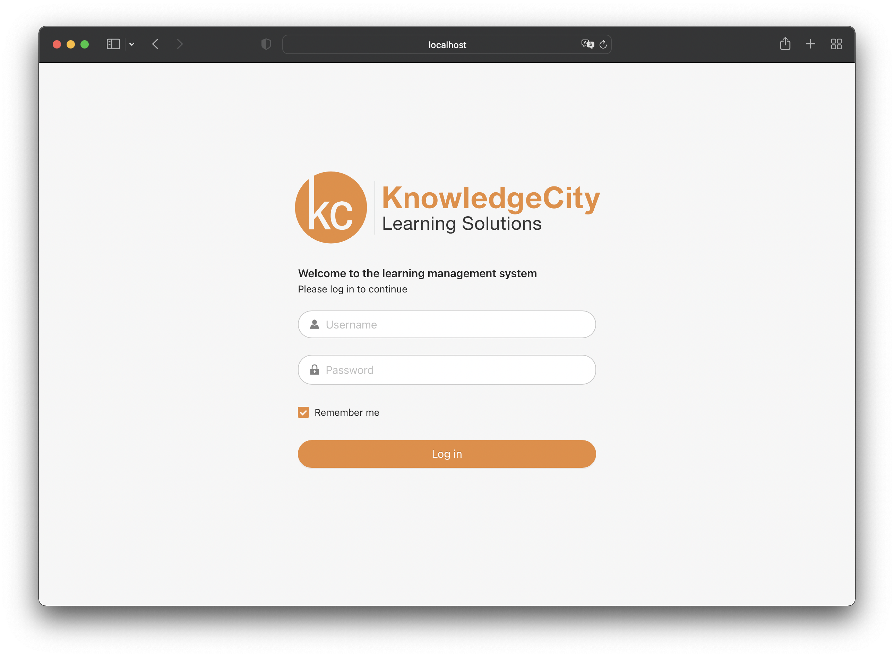

<p align="center">
  

  <h3 align="center">Test task for the interview</h3>

  <p align="center">
    Mini web-app which consist of two pages
  </p>
</p>


### About The Project

 | 
---|---


### Built With
* [React](https://github.com/facebook/react)
* [Ant Design](https://github.com/ant-design/ant-design/)
* [React redux](https://github.com/reduxjs/react-redux)
* [React router](https://github.com/remix-run/react-router)
* [Create react app](https://github.com/facebook/create-react-app)
* [Typescript](https://github.com/microsoft/TypeScript)

### Requirements

* [Node.js 16.14.2 or compatible with react 17](https://nodejs.org/en/)
* [yarn 1.x](https://yarnpkg.com/) - *optional*

### How to start

1. Install dependencies
```sh
yarn or npm install
```

2. Run dev server
```sh
yarn start or npm run start
```

If production build is required.
```sh
yarn build or npm run build
```

### Credentials

Login: user

Password: user